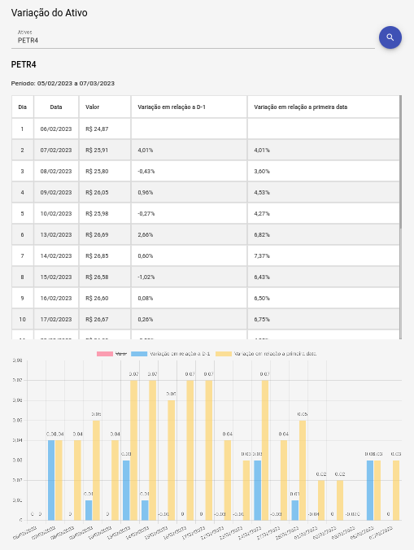

# Variação do Ativo

Projeto em Angular com alguns pacotes adicionais, como Angular Material, ng2-chart e date-fns, que são utilizados para criar interfaces de usuário e gráficos interativos. Além disso, ele também faz uso da API do Yahoo Finance para buscar dados de ações.

## Captura de tela



## Apêndice

Antes de começar, você precisará ter o Node.js instalado em sua máquina. Este projeto foi criado com o Angular 15, portanto, certifique-se de ter a versão compatível (mínima de v16.13 ou v18.10) instalada em sua máquina.

## Instalação

Para instalar as dependências do projeto, abra um terminal na raiz do projeto e execute o seguinte comando:

```bash
  npm install
```

## Executando o projeto

Para executar o projeto em um servidor de desenvolvimento, execute o seguinte comando:

```bash
  npm start
```

Após o processo de compilação, o projeto estará disponível em http://localhost:4200/.

## Pacotes utilizados

**Angular Material:** conjunto de componentes para Angular que implementam os princípios de design do Material Design do Google.

**ng2-chart:** pacote que fornece diretivas para criar gráficos com o Chart.js.

**date-fns:** biblioteca de utilitários para manipulação de datas em JavaScript.

**API do Yahoo Finance:** API para buscar dados de ações.
